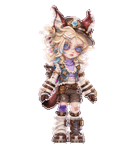
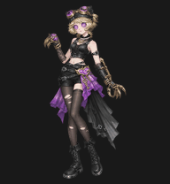
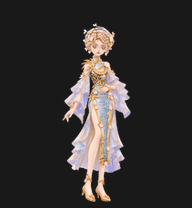

# 第五人格桌宠 · Identity V Desktop Pets

> 庄园的故事没有离开，只是缩到桌面的一角。

这是一个《第五人格》非官方同人桌宠合集。这里收录角色与时装的 Codex 动态宠物、安装包和动作预览，也欢迎继续补充新的角色、时装与不同画风。

我们不想只把角色做成“会动的贴图”。每一只桌宠都会尽量保留一点属于角色和时装的叙事：幻灯里被切碎的时间、锁住旧日温度的机芯、钟阁里忽然停下的杼声——然后再把这些意象落进待机、奔跑、挥手、跳跃和注视里。

当前发布包使用 **v2 精灵图**：9 组动作、16 个注视方向。不同版本使用独立 ID，可以并存。

## 今夜登场

| 角色 · 时装 | 版本 | 下载 | 预览 |
| --- | --- | --- | --- |
| 幻灯师 · 于此岸赴宴 | 标准版 | [下载 ZIP](downloads/幻灯师·于此岸赴宴.zip) | [动作总览](preview/幻灯师·于此岸赴宴/contact-sheet.png) · [左跑](preview/幻灯师·于此岸赴宴/running-left.gif) |
| 幻灯师 · 于此岸赴宴 | Q版 | [下载 ZIP](downloads/幻灯师·于此岸赴宴%20Q版.zip) | [动作总览](preview/幻灯师·于此岸赴宴%20Q版/contact-sheet.png) · [左跑](preview/幻灯师·于此岸赴宴%20Q版/running-left.gif) |
| 机械师 · 锁芯 | 标准版 | [下载 ZIP](downloads/机械师·锁芯.zip) | [全部动作](preview/机械师·锁芯/all-states.gif) · [动作总览](preview/机械师·锁芯/contact-sheet.png) |
| 机械师 · 锁芯 | Q版 | [下载 ZIP](downloads/机械师·锁芯%20Q版.zip) | [全部动作](preview/机械师·锁芯%20Q版/all-states.gif) · [MP4](preview/机械师·锁芯%20Q版/all-states.mp4) · [动作总览](preview/机械师·锁芯%20Q版/contact-sheet.png) |
| 舞女 · 钟阁杼思 | 原版 | [下载 ZIP](downloads/舞女·钟阁杼思.zip) | [全部动作](preview/舞女·钟阁杼思/all-states.gif) · [动作总览](preview/舞女·钟阁杼思/contact-sheet.png) |
| 祭司 · 绯 | 修长玩偶版 | [下载 ZIP](downloads/祭司·绯.zip) | [全部动作](preview/祭司·绯/all-states.gif) · [MP4](preview/祭司·绯/all-states.mp4) |
| 机械师 · 心锁 | 修长人偶版 | [下载 ZIP](downloads/机械师·心锁.zip) | [全部动作](preview/机械师·心锁/all-states.gif) · [MP4](preview/机械师·心锁/all-states.mp4) |

## 角色与时装

### 幻灯师 · 于此岸赴宴

阿曼达·加蒂斯的一生常被突如其来的睡意、幻觉与断裂的时间感切开。童年的小天窗曾是她观察世界的窄小边框；后来，光学窥视盒与幻灯仪成了另一种方式——把那些真假难辨、稍纵即逝的事物重新框进手中。

「于此岸赴宴」沿着同一条脉络，把“幸福的青鸟”从遥远的许诺变成可以被追逐、捕获甚至拆穿的象征。她不等待幸福从彼岸抵达：尖耳、利爪、指虎、伤痕与机械鳄鱼，都指向同一种近乎蛮横的选择——现实哪怕粗粝，也比空中的幻影更值得抓住。

标准版保留修长轮廓与装备感；Q版把比例缩小，却没有把她的锋利、顽皮和不安分一起缩小。

### 机械师 · 锁芯

特蕾西·列兹尼克在钟表店和工作室里长大。对她而言，齿轮、误差、机关与线路都有可以追索的因果；父亲留下的爱、那场改变一切的事故、随之而来的债务与未完成的发明，却让“修好一切”这件事变得没有那么简单。庄园真正吸引她的，也从来不只是奖金，而是那些尚未被拆开的秘密机关。

「锁芯」把这种性格收束成一个非常直接的意象：黑色的锁扣在外，曾经炽热的机芯被藏在里面。紫晶、机械结构与哥特轮廓让她像一台精密而未完成的装置——看起来冷静，内部却仍有某种反应没有停止。

标准版强调纤长比例与机械肢体；Q版保留猫耳帽、紫晶锁瞳和非对称机械臂，让“锁住的机芯”变成更小、更倔强的一团。

[锁芯全部动作](preview/机械师·锁芯/all-states.gif) · [锁芯 16 方向注视](preview/机械师·锁芯/look-loop.gif) · [Q版左右奔跑](preview/机械师·锁芯%20Q版/running-left.gif)

### 舞女 · 钟阁杼思

玛格丽莎·泽莱熟悉舞台、华服、掌声，也熟悉“自由”背后并不轻盈的代价。她曾试着用新的名字、新的生活和新的去处离开过去；可真正属于自己的方向，往往不是别人替她写好的那一条。

「钟阁杼思」取意于铜镀金乡村景色水法钟：纺车、帆船、流水、钟鸣与齿轮把时间组织成精密的循环，而舞者被放在循环将停未停的瞬间。机杼声止，舞步才第一次不必服从指针——不是被钟表收藏的人偶，而是准备从钟阁里走出去的人。

[全部动作](preview/舞女·钟阁杼思/all-states.gif) · [16 方向注视](preview/舞女·钟阁杼思/look-loop.gif)

### 祭司 · 绯

红发、黑色弯角和十字纽扣眼，被收进黑白裙装的修长玩偶轮廓。她停下脚步抬手招呼，再屈膝跃起；本次发布包含已确认的跳跃与打招呼修正版。

[全部动作](preview/祭司·绯/all-states.gif) · [MP4](preview/祭司·绯/all-states.mp4) · [16 方向注视](preview/祭司·绯/look-loop.gif)

### 机械师 · 心锁

护目镜礼帽、金色纽扣眼与红金外套，收在修长人偶的轮廓里。她握着心锁点头、跃起，深蓝裙摆与靴子一同落回桌面。本次发布包含跳跃头部动作及鞋款一致性修正版。

[全部动作](preview/机械师·心锁/all-states.gif) · [跳跃](preview/机械师·心锁/jumping.gif) · [MP4](preview/机械师·心锁/all-states.mp4) · [16 方向注视](preview/机械师·心锁/look-loop.gif)

## 安装到 Codex

适用于支持本地自定义宠物及 **v2 精灵图** 的 Codex 桌面客户端。这里提供的是本地文件包；GitHub ZIP 不是 ChatGPT Work 的一键领养链接。尚未对所有客户端或所有版本做安装测试。

1. 下载所选版本 ZIP，在 GitHub 文件页面点击 **Download raw file**。
2. 解压，将完整宠物文件夹放入 `$CODEX_HOME/pets/`；未设置 `CODEX_HOME` 时，默认目录为 `~/.codex/pets/`。Windows 默认位置为 `%USERPROFILE%\\.codex\\pets\\`。
3. `pet.json` 与 `spritesheet.webp` 必须位于同一文件夹。不要覆盖已有同名文件夹；保留配置中的 `spriteVersionNumber: 2`。
4. 重启 Codex，然后在客户端宠物选择界面选用对应名称。若客户端不支持 v2 或没有显示本地宠物，请先确认客户端支持情况。

## 图集规格与验证

每款均含原始 PNG 与像素一致的无损 WebP，运行时配置指向 WebP。精灵图为透明背景，1536 × 2288 像素，8 列 × 11 行，每格 192 × 208 像素，共 73 个有效帧。

前九行动作为待机、向右跑、向左跑、挥手、跳跃、失败反应、等待、工作、复核；帧数依次为 `6, 8, 8, 4, 5, 8, 6, 6, 6`。最后两行包含 16 个视线方向，从正上方开始按顺时针每隔 22.5° 排列。未使用的 15 格保持透明。

## 欢迎投稿

欢迎新的角色、时装、不同画风，也欢迎动作修复、安装说明和客户端适配。

- 想看某个角色、遇到问题，或作品还没有整理完整：直接提 [Issue](https://github.com/YinL-k/identity-v-lanternist-feast-on-this-shore-codex-pet/issues)
- 已有作品：提交 [Pull Request](https://github.com/YinL-k/identity-v-lanternist-feast-on-this-shore-codex-pet/pulls)，附预览，并注明原作者与来源
- 不要求提交授权证明；请尊重原作者明确标注的使用限制，署名本身不代替授权

目录、图集要求，以及如何写出和现有角色一致的文案，见 [CONTRIBUTING.md](CONTRIBUTING.md)。

## 设定参考与文案说明

仓库中的角色小传与桌宠描述，是基于公开角色故事、时装主题和视觉元素进行的**非官方二次创作文案**，不是网易游戏官方原文，也不会把二创文字包装成官方设定。

主要参考：

- [幻灯师故事视频情报](https://www.taptap.cn/moment/715688812163893603)
- [幻灯师「于此岸赴宴」局内效果与时装主题](https://www.taptap.cn/moment/721755606368651473)
- [机械师角色背景](https://www.taptap.cn/moment/15203424429673242)
- [机械师「锁芯」三视图与主题](https://www.taptap.cn/moment/621392800495174658)
- [舞女角色曲《玛格丽莎的舞台》](https://www.taptap.cn/moment/604000807095894410)
- [故宫观唐联动「铜镀金乡村景色水法钟」背景](https://www.taptap.cn/moment/705380462306002231)

## 声明与署名

本项目为非官方同人作品，仅供个人学习、展示和非商业使用。《第五人格》及相关角色、时装、名称、原始设计和素材的权利归各自权利人所有。本项目与网易游戏无隶属、赞助或官方认可关系。

- 角色与时装原始设计：网易游戏《第五人格》
- 当前桌宠制作与整理：[YinL-k](https://github.com/YinL-k)，使用 AI 辅助制作
- 社区投稿：在对应作品说明中保留原作者、贡献者与来源

详见 [NOTICE.md](NOTICE.md)。

